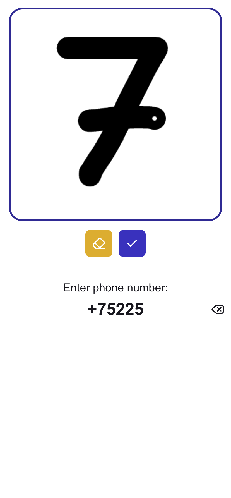

# About
<div style="display: flex; align-items: center; gap: 20px;">
  
  <div>
  <p>
    Recognition of handwritten numbers on a canvas drawboard using a trained model on the website
    <a href="https://teachablemachine.withgoogle.com" target="_blank">Teachable Machine</a>.
  </p>

  **Warning!**
  Use for educational purposes only, as the model works unstably and frequently makes errors in recognizing symbols. A small number of samples was used for training. There may also be issues with exporting the image from the canvas and providing the handwritten input to the model.

  </div>
</div>


# Get started
### **Standard project launch**
1. Install dependencies
    ```shell
    npm install
    ```
2. Build the project
    ```shell
    npm run build
    ```
3. Start the project
    ```shell
    npm run start
    ```

### **Launching the project in dev mode**
1. Install dependencies
    ```shell
    npm i
    ```
2. Start in dev mode
    ```shell
    npm run dev
    ```

### **In case the character recognition model does not work**
The project may start and build without errors, but character recognition may not work. This could be because the trained model is loaded via a cloud link in the component `shared/hooks/useModel.ts` (variable `MODEL_PATH`).

If this happens, you can use local files of the same trained model located in `public/model` (files: `metadata.json`, `model.json`, `weights.bin`).

### **Create your own model**
You can create your own model on [Teachable Machine](https://teachablemachine.withgoogle.com)